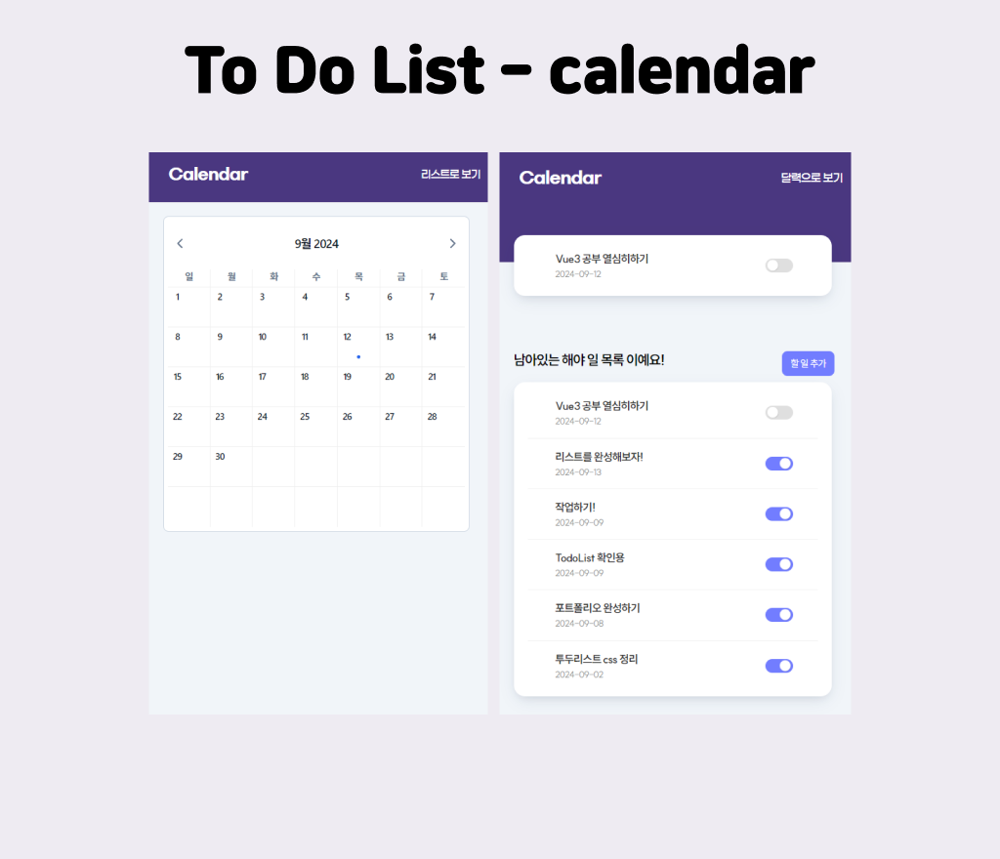

## 달력에 일정관리 To Do List
```

### 프로젝트 소개
```
- 달력에 To Do List 기능을 추가하여 할일 체크 및 일정관리를 할 수 있는 화면을 만들고자 하였습니다.
- v-calendar 라이브러리를 추가하여 달력 UI를 구현했습니다.
- 달력에 날짜를 눌렀을 때 modal 창을 띄워서 새 할일목록을 작성할 수 있도록 하였습니다.
- 할일 목록은 리스트형으로도 볼 수 있으며, 토글버튼을 이용해 완료항목을 정리할 수 있습니다.

```
### 프로젝트 설명
```
- 작업기간 : 2024.05.06 - 2024.05.14
- 사용 언어: Vue.js, scss 사용

```
